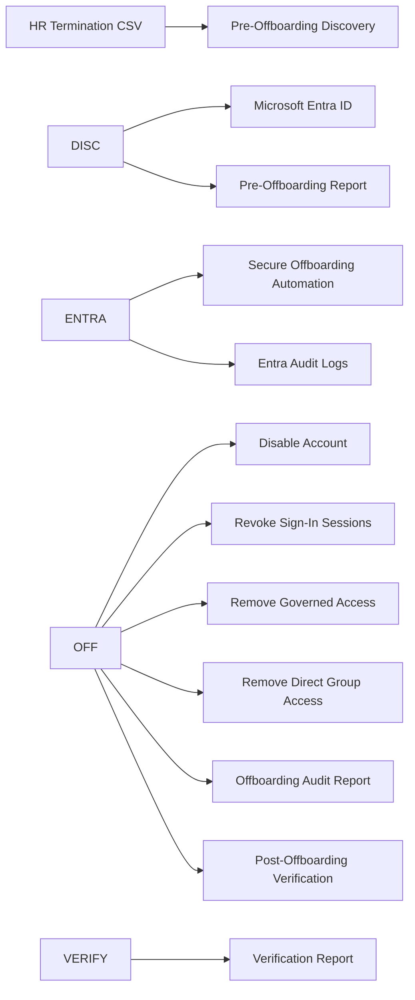

# Entra ID Secure Offboarding Automation

## Project Overview

This project demonstrates a secure employee offboarding workflow using Microsoft Entra ID, Microsoft Graph PowerShell, and Microsoft Entra Identity Governance.

The scenario simulates the termination of a Finance employee whose access includes both baseline security group membership and governed Finance access provisioned through an Access Package. The automation processes HR termination data, captures the employee's existing access, disables the identity, revokes active sign-in sessions, removes applicable access according to its provisioning source, and independently verifies the resulting identity state.

Rather than treating successful PowerShell commands as sufficient evidence, the project uses pre-offboarding discovery, structured audit reports, post-offboarding verification, and Microsoft Entra audit logs to demonstrate that access was actually removed.

### Key Capabilities

* HR-driven termination input using CSV data
* Pre-offboarding identity and access discovery
* State-aware account disablement
* Active sign-in session revocation
* Source-aware access deprovisioning
* Microsoft Entra Access Package removal
* Direct security group removal
* Before-and-after access reconciliation
* Structured PowerShell audit reporting
* Independent post-offboarding verification
* Microsoft Entra audit-log validation
* Resilient and repeatable PowerShell automation

## Business Problem

Employee termination creates significant identity risk when access is removed inconsistently or through manual processes. Disabling an account alone may not address active sessions, group-based authorization, governed entitlements, or the need to prove that access was successfully removed.

A secure offboarding process should identify the employee's existing access before changes occur, apply the appropriate deprovisioning control based on how the access was granted, and verify the resulting identity state.

This project addresses that problem by creating an auditable Microsoft Entra ID offboarding workflow that connects termination data to identity discovery, deprovisioning, verification, and audit evidence.

## Solution

The solution separates the offboarding lifecycle into three PowerShell processes:

1. **Pre-Offboarding Discovery** — captures the employee's account status, group memberships, and license assignments before deprovisioning.
2. **Secure Offboarding** — disables the account, revokes active sessions, removes governed Finance access through Entitlement Management, removes applicable direct group access, and records the outcome of each control.
3. **Post-Offboarding Verification** — independently queries Microsoft Entra ID after the changes and confirms the employee's resulting account, group, and license state.

This separation creates a clear **Discover → Deprovision → Verify** model and avoids relying on the identity-changing script as the only source of evidence that offboarding succeeded.

## IAM Architecture

The project models an HR-driven identity lifecycle workflow in which termination data initiates discovery, deprovisioning, verification, and audit activities in Microsoft Entra ID.

The architecture intentionally separates **discovery**, **deprovisioning**, and **verification**. This creates multiple sources of evidence and supports before-and-after access reconciliation rather than relying only on successful PowerShell execution.

## Access Governance

The Finance employee's access was designed to demonstrate two different authorization models:

* **Baseline Access:** Direct membership in the `All Employees` security group.
* **Governed Finance Access:** Membership in the `Finance Team` security group provisioned through the `Finance Operations Access Package`.

The Finance Access Package was configured in Microsoft Entra Identity Governance with `All Employees` as the eligible population. Users could request Finance access with business justification, and approval was required before the entitlement was provisioned. Assignments were configured with a 365-day expiration, with extensions requiring approval.

This distinction is important during offboarding because access should be removed through its authoritative provisioning source. Since `Finance Team` membership was provisioned through Entitlement Management, the offboarding automation removes the Access Package assignment rather than directly removing the resulting group membership.

### Finance Access Package

The `Finance Operations Access Package` provides governed membership to the `Finance Team` security group.

*Finance Access Package Resources (Screenshots/03-Finance-Access-Package-Resources part 1.png)*

*Finance Access Package Resources (Screenshots/03-Finance-Access-Package-Resources part 2.png)*

### Governed Finance Assignment

Before offboarding, the employee successfully requested and received the Finance Access Package, resulting in governed access to the `Finance Team` security group.

*Finance Access Package Assignment (Screenshots/13-Bob-Finance-Access-Package-Assignment.png)*

## Offboarding Workflow

The offboarding process begins with a CSV file representing termination data received from an HR system. Using a CSV rather than hard-coding employee information allows the automation to process termination records dynamically.

The termination input contains the employee's User Principal Name, employee name, department, and termination date.

### HR Termination Input

*HR Termination CSV - Part 1 (Screenshots/15-Termination-Input-CSV part 1.png)*

*HR Termination CSV - Part 2 (Screenshots/15-Termination-Input-CSV part 2.png)*

The automation processes the termination record through the following workflow:

1. **Validate Identity** — Locate the employee in Microsoft Entra ID using the User Principal Name.
2. **Capture Existing Access** — Record the employee's account status, group memberships, and license assignments before making changes.
3. **Disable Account** — Set the Entra ID account to disabled to prevent future authentication.
4. **Revoke Sign-In Sessions** — Revoke active sign-in sessions to address existing authenticated sessions.
5. **Remove Governed Access** — Remove the Finance Access Package assignment through Microsoft Entra Entitlement Management.
6. **Remove Direct Access** — Remove direct membership from the `All Employees` security group.
7. **Verify Deprovisioning** — Independently query the employee's resulting account, group, and license state.
8. **Generate Audit Evidence** — Produce structured CSV reports and validate key changes through Microsoft Entra audit logs.

The workflow is state-aware. Before performing applicable changes, the automation evaluates the employee's current identity state so that previously completed controls are not unnecessarily repeated.

## Microsoft Graph + PowerShell

The solution uses the Microsoft Graph PowerShell SDK to interact with Microsoft Entra ID and Identity Governance. The automation is divided into three scripts so that access discovery, identity-changing operations, and verification remain separate.

### 1\. Pre-Offboarding Discovery

[`Get-PreOffboardingAccess.ps1`](Scripts/Get-PreOffboardingAccess.ps1) performs read-only discovery before deprovisioning begins. It validates the employee in Entra ID and captures:

* Account status
* Department and job title
* Group memberships
* License assignments
* Termination date

The results are exported to `Reports/Pre-Offboarding-Access.csv`, preserving the employee's access state before changes occur.

### 2\. Secure Offboarding

[`Invoke-Offboarding.ps1`](Scripts/Invoke-Offboarding.ps1) performs the identity-changing operations. The script:

* Checks the employee's current account state and disables the account when required.
* Revokes active sign-in sessions.
* Locates and removes the active Finance Access Package assignment.
* Checks for and removes direct `All Employees` group membership.
* Records the result of each control in a structured audit report.

The automation uses state-aware checks so repeated execution can distinguish between actions that still need to be performed and controls that have already been completed.

### 3\. Post-Offboarding Verification

[`Verify-Offboarding.ps1`](Scripts/Verify-Offboarding.ps1) independently queries Microsoft Entra ID after deprovisioning. It verifies:

* Account status
* Remaining group memberships
* Remaining license assignments

The results are exported to `Reports/Post-Offboarding-Verification.csv`, providing independent evidence of the employee's resulting identity state.

### Microsoft Graph Permissions

The final offboarding script requests targeted delegated Microsoft Graph permissions for its identity lifecycle operations:

* `User.Read.All`
* `User.EnableDisableAccount.All`
* `User.RevokeSessions.All`
* `Group.Read.All`
* `GroupMember.ReadWrite.All`
* `EntitlementManagement.ReadWrite.All`

The project uses delegated authentication for the lab environment. A production implementation should validate the minimum required API permissions and Microsoft Entra administrative roles for the automation identity.

## Before/After Verification

A key design goal of the project was to verify that deprovisioning actually changed the employee's identity state rather than assuming successful PowerShell execution meant access had been removed.

### Before Offboarding

Pre-offboarding discovery confirmed that the employee account was enabled and had access through both baseline and governed group membership:

* `AccountEnabled = True`
* `All Employees`
* `Finance Team`
* No assigned licenses

The Finance Team membership originated from the approved Finance Access Package assignment.

*Pre-Offboarding Access Report (Screenshots/19-Pre-Offboarding-Access-Report.png)*

### After Offboarding

The separate verification script queried Microsoft Entra ID after deprovisioning and confirmed:

* `AccountEnabled = False`
* Remaining group memberships: `None`
* Remaining licenses: `None`

*Post-Offboarding Verification Report (Screenshots/26-Post-Offboarding-Verification-Report.png)*

### Access Reconciliation

The before-and-after reports demonstrate the employee's transition from an enabled identity with baseline and Finance access to a disabled identity with no remaining group memberships or license assignments.

| Control | Before Offboarding | After Offboarding |

|---|---|---|

| Account | Enabled | Disabled |

| All Employees | Member | Removed |

| Finance Team | Member through Access Package | Removed |

| Licenses | None | None |

This reconciliation provides independent evidence that the expected identity state was achieved after offboarding.

## Audit \& Reporting

The offboarding workflow produces a structured audit report that records the outcome of each security control for the terminated employee.

The report tracks:

* Account disablement
* Sign-in session revocation
* Finance Access Package removal
* All Employees group removal
* Overall workflow status

### Offboarding Audit Report

The final state-aware validation recorded the account as `Already Disabled`, sign-in sessions as `Revoked`, Finance access as `Already Removed`, and All Employees access as `Already Removed`, with an overall status of `Completed`.

*Final Offboarding Audit Report (Screenshots/33-Final-Offboarding-Audit-Report.png)*

### Microsoft Entra Audit Evidence

PowerShell-generated reports are supplemented with Microsoft Entra audit logs, providing platform-generated evidence of key identity changes.

#### Account Disablement

Microsoft Entra recorded the modification to the employee's user object, showing `AccountEnabled` changing from `true` to `false`.

*Entra Audit Account Disabled (Screenshots/28-Entra-Audit-Account-Disabled.png)*
 

#### Governed Finance Access Removal

Microsoft Entra recorded a successful `Administrator directly removes user access package assignment` event. This confirms that Finance access was deprovisioned through Entitlement Management rather than by directly removing the resulting Finance Team group membership.

*Entra Audit Access Package Removed (Screenshots/29-Entra-Audit-Access-Package-Removed.png)*

#### Baseline Group Removal

Microsoft Entra recorded a successful `Remove member from group` operation initiated through Microsoft Graph. The audit details identify the affected group as `All Employees`.

*Entra Audit All Employees Group Removed (Screenshots/31-Entra-Audit-All-Employees-Removed.png)*
 

Together, the automation reports, independent post-offboarding verification, and Microsoft Entra audit logs provide multiple layers of evidence that the expected offboarding controls were successfully applied.

## Challenges \& Lessons Learned

Building the workflow highlighted several important IAM automation and access-governance concepts.

### Provisioning Source Matters

One of the most important design decisions was distinguishing between direct group membership and access provisioned through Microsoft Entra Entitlement Management.

Although the Finance Access Package ultimately provisioned membership in `Finance Team`, directly removing the user from the group would not address the governing entitlement. The automation therefore removes the Access Package assignment through Entitlement Management, while direct `All Employees` membership is removed separately.

### Successful Execution Is Not Verification

A successful PowerShell command does not necessarily prove that the expected identity state was achieved. For this reason, the project uses a separate read-only verification script to query the employee after deprovisioning and confirm the resulting account, group, and license state.

### State-Aware Automation

The workflow was designed to evaluate the employee's current state before performing applicable changes. During repeated execution, the automation correctly identified controls that had already been completed instead of treating them as failures.

This makes the workflow safer to rerun and produces more meaningful audit results such as `Already Disabled` and `Already Removed`.

### Resilient Error Handling

Independent offboarding controls are handled separately so that one failed operation does not automatically prevent other security controls from being attempted. Each control records its own result, and unexpected conditions contribute to an overall `Completed with Errors` status rather than being incorrectly reported as successful.

### Reporting Across Multiple Employees

The reporting logic collects results during processing and exports the complete dataset after all termination records have been evaluated. This prevents later records from overwriting earlier results and allows the workflow to scale beyond a single termination record.

## Security Considerations

Security was considered throughout the design of the offboarding workflow, including API permissions, identity retention, sensitive data handling, and safe automation practices.

### Least-Privilege Microsoft Graph Access

The final offboarding script requests targeted delegated Microsoft Graph permissions for the operations it performs rather than relying on a single broad directory write permission.

Microsoft Entra administrative roles must also be appropriately scoped because API permissions alone do not authorize every administrative operation.

For a production implementation, the automation should use a dedicated automation identity and only the permissions and administrative roles required for the specific lifecycle operations.

### Disable Before Delete

The lab disables the terminated employee's account rather than immediately deleting the identity. This prevents future authentication while retaining the user object for verification, investigation, and audit purposes.

Permanent deletion could be handled later according to an organization's identity-retention and data-governance policies.

### Source-Aware Access Removal

Access is removed according to how it was originally provisioned. Governed Finance access is removed through the Access Package assignment, while applicable direct group membership is handled separately.

This helps avoid leaving the governing entitlement active after only removing its downstream group membership.

### Sensitive Data Protection

Before publication, tenant-specific identifiers were sanitized from the repository. User Principal Names and tenant-specific domains in sample data, reports, and screenshots were replaced or redacted while preserving the technical results of the lab.

No passwords, access tokens, client secrets, tenant IDs, authentication codes, or other credentials are published in the repository.

### Safe Lab Execution

Identity-changing operations were performed only against test identities in a lab environment. The project separates read-only discovery and verification from the script that performs deprovisioning changes, reducing the risk of unintentionally modifying identities during validation.

## Business Impact

This project demonstrates how identity lifecycle automation can reduce the security and operational risks associated with manual employee offboarding.

By connecting termination data to Microsoft Entra ID, the workflow provides a repeatable process for discovering existing access, disabling the identity, revoking sessions, removing applicable access, and independently verifying the resulting state.

Key business benefits include:

* **Reduced access risk** — terminated identities are disabled and applicable access is removed through the appropriate provisioning source.
* **Improved consistency** — the same offboarding controls can be applied through a repeatable workflow rather than relying entirely on manual administration.
* **Stronger auditability** — pre-offboarding discovery, automation results, post-offboarding verification, and Entra audit logs provide multiple layers of evidence.
* **Improved governance** — governed access is removed through Entitlement Management rather than bypassing the system that originally provisioned it.
* **Scalable design** — CSV-driven processing and consolidated reporting allow the workflow to support multiple termination records.

## Future Enhancements

The lab can be expanded to represent a broader enterprise offboarding architecture. Potential enhancements include:

* Integrating directly with an HR system or API instead of using a CSV termination feed.
* Using application-based authentication or a managed identity for unattended automation.
* Adding Microsoft Entra role-assignment discovery and removal.
* Detecting dynamic group memberships and distinguishing them from directly removable memberships.
* Expanding license handling to account for direct and group-based licensing.
* Adding Access Reviews and additional Identity Governance controls.
* Sending notifications or creating service-management tickets when offboarding controls fail.
* Archiving audit results to a centralized logging or SIEM platform.
* Adding automated tests and exception handling for unresolved termination records.

